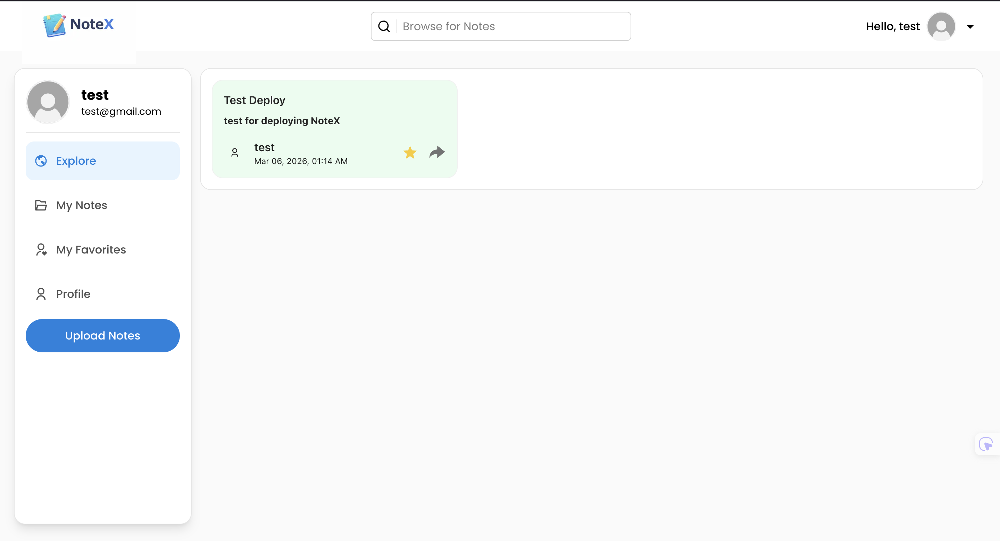
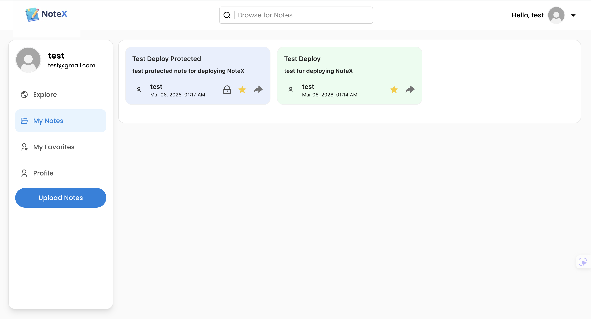
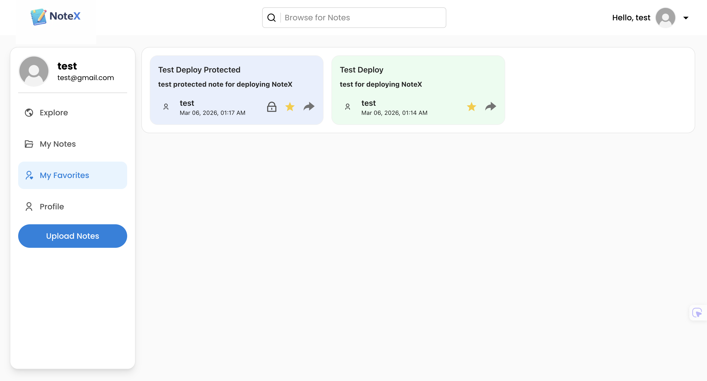
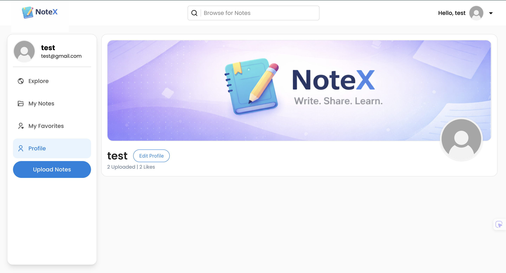
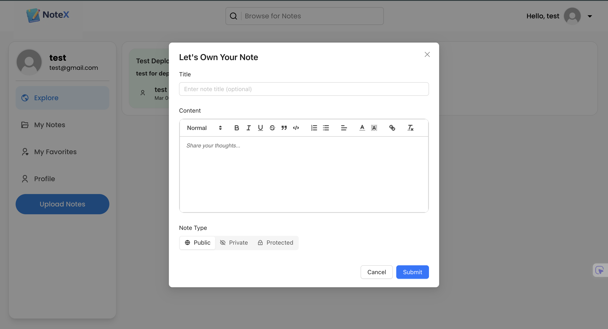

# NoteX


A modern full-stack note sharing platform that allows users to create, manage, and explore notes online.

NoteX enables users to publish notes publicly, keep notes private, or protect them with passwords.  
The platform is built with **Next.js**, **Python (Flask)**, and **MySQL**, and deployed using **Vercel** and **Railway**.

---

## Live Demo

🔗 **Live App:** https://notex-one.vercel.app/

---

## Screenshots

### Home Page


### My Notes


### My Favorites


### My Profile


### Upload Notes


---

## Features

- User authentication with JWT
- Create, edit, and delete notes
- Public and private note visibility
- Password-protected notes
- Browse public notes
- Favorite notes
- Search notes instantly using the search bar
- Rich text editor for formatting notes
- Responsive user interface
- Secure REST API

---

## Tech Stack

### Frontend
- Next.js
- React
- Zustand
- Ant Design

### Backend
- Python
- Flask
- SQLAlchemy
- JWT Authentication
- Bcrypt password hashing
- REST API

### Database
- MySQL

### Deployment
- Vercel (Frontend hosting)
- Railway (Backend API + MySQL)

---

## Architecture
```text
User Browser
   ↓
Next.js Frontend (Vercel)
   ↓ API Requests
Flask Backend (Railway)
   ↓
MySQL Database (Railway)
```

---

## Project Structure
```text
NoteX
├── BE            # Flask backend API
├── FE            # Next.js frontend
├── screenshots   # Application screenshots used in README
├── README.md
└── LICENSE
```
---

## How to Use

1. Visit the website:

https://notex-one.vercel.app/

2. Create an account or log in.

3. Start creating notes.

4. Choose to make your notes:
   - Public
   - Private
   - Password protected

5. Browse notes shared by other users.

---

## Future Improvements

- **Real-time collaboration**  
  Allow multiple users to edit the same note simultaneously using WebSockets.

- **Advanced search and filtering**  
  Implement full-text search and filters by author, popularity, or date.

- **Note version history**  
  Track and restore previous versions of notes, similar to Git-style version control.

- **Tagging and categorization system**  
  Allow users to organize notes with tags and browse notes by topic.

- **Commenting and discussion system**  
  Enable users to comment on notes and start discussions.

- **Image and file attachments**  
  Allow users to embed images or upload files within notes.

- **User following system**  
  Let users follow other authors and see their latest notes in a personalized feed.

- **Performance optimization with caching**  
  Implement caching (e.g., Redis) to improve performance for frequently accessed notes.

---

## Author

Nixon Lesmana

---

## License

MIT License
